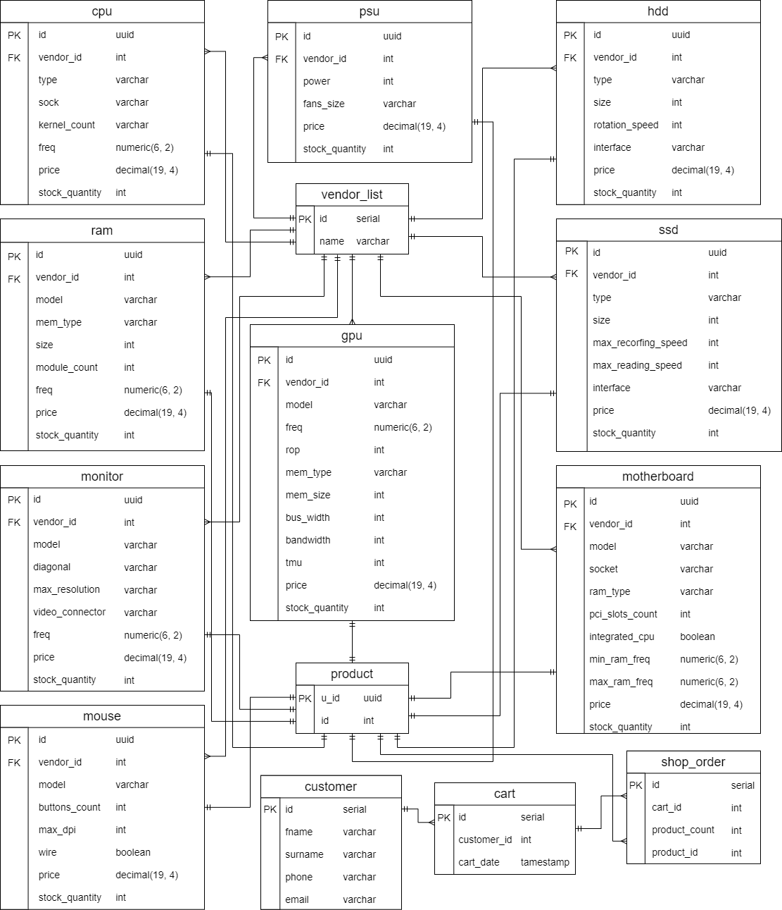

# Практика 2 курс
## Модель базы данных
<p align="center">
    
</p>

## Описание эндпоинтов
### 1. Список всех покупателей
##### Запрос
```GET http://api/customer```
##### Ответ
```json
[
   {
      "id":1,
      "fname":"Daniil",
      "surname":"Ivanov",
      "phone":"89024987478",
      "email":"the5dan5y@gmail.com"
   },
   {
      "id":2,
      "fname":"Otinov",
      "surname":"Oleg",
      "phone":"88005553535",
      "email":"simanfriderick@gmail.com"
   }
]
```
### 2. Список всех процессоров
##### Запрос
```GET http://api/cpu```
##### Ответ
```json
[
   {
      "id":"d4f76cb0-4441-448d-8358-b847c89aba75",
      "vendor_id":1,
      "type":"core i5",
      "sock":"LGA 1151v2",
      "kernel_count":6,
      "freq":"2.90",
      "price":"11990.0000",
      "stock_quantity":55
   }
]
```
### 3. Список всех видеокарт
##### Запрос
```GET http://api/gpu```
##### Ответ
```json
[
   {
      "id":"fd1625b5-967d-4280-a1e5-84a29d6c3396",
      "vendor_id":6,
      "model":"GeForce GTX 1660",
      "freq":"1530.00",
      "rop":48,
      "mem_type":"GDDR6",
      "mem_size":6,
      "bus_width":192,
      "bandwidth":336,
      "tmu":88,
      "price":"18999.0000",
      "stock_quantity":9
   }
]
```
### 4. Список всех материнских плат
##### Запрос
```GET http://api/motherboard```
##### Ответ
```json
[
   {
      "id":"bac512ba-f061-4c10-a053-30f8952953ee",
      "vendor_id":5,
      "model":"B450 AORUS ELITE",
      "socket":"AM4",
      "ram_type":"DDR4",
      "pci_slots_count":2,
      "integrated_cpu":false,
      "min_ram_freq":"2133.00",
      "max_ram_freq":"3200.00",
      "price":"8699.0000",
      "stock_quantity":24
   }
]
```
### 5. Список всех жестких дисков
##### Запрос
```GET http://api/hdd```
##### Ответ
```json
[
   {
      "id":"a51b63ae-6028-4682-bf53-2e2f72dd7d82",
      "vendor_id":9,
      "type":"BarraCuda",
      "size":1000,
      "rotation_speed":7200,
      "interface":"SATA III",
      "price":"3199.0000",
      "stock_quantity":1
   }
]
```
### 6. Список всех ssd
##### Запрос
```GET http://api/ssd```
##### Ответ
```json
[
   {
      "id":"cfbc8d8b-f157-4aa7-867c-fee1d68a3a6e",
      "vendor_id":10,
      "type":"860 EVO",
      "size":500,
      "max_recording_speed":520,
      "max_reading_speed":550,
      "interface":"SATA III",
      "price":"6099.0000",
      "stock_quantity":2
   }
]
```
### 7. Список ОЗУ
##### Запрос
```GET http://api/ram```
##### Ответ
```json
[
   {
      "id":"3de938b5-9d2e-4e15-b3e3-2aca8104329b",
      "vendor_id":4,
      "model":"Fury Black",
      "mem_type":"DDR4",
      "size":8,
      "module_count":2,
      "freq":"2.66",
      "price":"5999.0000",
      "stock_quantity":12
   }
]
```
### 8. Список всех мониторов
##### Запрос
```GET http://api/monitor```
##### Ответ
```json
[
   {
      "id":"c9f3ee0c-b598-45a9-8617-bd5745b4b521",
      "vendor_id":10,
      "model":"C24RG50FQI",
      "diagonal":"23.5\"",
      "max_resolution":"1920x1080",
      "video_connector":"HDMI",
      "freq":"144.00",
      "price":"13999.0000",
      "stock_quantity":25
   }
]
```
### 9. Список всех мышек
##### Запрос
```GET http://api/mouse```
##### Ответ
```json
[
   {
      "id":"449adff2-5908-4792-8cf8-cf5711389317",
      "vendor_id":11,
      "model":"G305 LIGHTSPEED",
      "buttons_count":6,
      "max_dpi":12000,
      "wire":false,
      "price":"3299.0000",
      "stock_quantity":99
   }
]
```
### 10. Список всех блоков питания
##### Запрос
```GET http://api/psu```
##### Ответ
```json
[
   {
      "id":"20c2bd4f-b479-461a-8552-fac6e2af96a6",
      "vendor_id":7,
      "power":500,
      "fans_size":"120x120",
      "price":"2050.0000",
      "stock_quantity":3
   }
]
```
### 11. Список всех производителей
##### Запрос
```GET http://api/vendor_list```
##### Ответ
```json
[
   {
      "id":1,
      "name":"Intel"
   },
   {
      "id":2,
      "name":"AMD"
   },
   {
      "id":3,
      "name":"Corsair"
   }
]
```
### 12. Список всех заказов
##### Запрос
```GET http://api/shop_order```
##### Ответ
```json
[
   {
      "id":1,
      "cart_id":1,
      "product_count":1,
      "product_id":1
   },
   {
      "id":2,
      "cart_id":1,
      "product_count":2,
      "product_id":2
   }
]
```
### 13. Список товаров в корзине
##### Запрос
```GET http://api/cart```
##### Ответ
```json
[
   {
      "id":1,
      "customer_id":1,
      "cart_date":"2020-08-02 23:40:06.583736"
   },
   {
      "id":2,
      "customer_id":2,
      "cart_date":"2020-05-18 00:00:00"
   }
]
```
